# Rekdin

Rekdin is an AI research and automation workspace built with Next.js, React, LangChain, and Puppeteer.

It is designed to make agent work inspectable instead of opaque:

- stream foreground chat turns over SSE
- run long tasks in the background
- persist sessions, replays, traces, artifacts, and settings
- expose tool execution in a timeline instead of hiding it behind a single response
- support multiple LLM providers behind one UI

## Stack

- Next.js 16
- React 19
- TypeScript
- LangChain
- Puppeteer / puppeteer-extra
- Zod
- IndexedDB on the client, JSON-backed persistence on the server

## Quick Start

1. Install dependencies:

```bash
npm install
```

2. Start the app:

```bash
npm run dev
```

3. Open `http://localhost:3000`.

4. Add a provider key and model in Settings before sending a message.

## Useful Scripts

- `npm run dev`: start the local app
- `npm test`: run Vitest
- `npm run typecheck`: run TypeScript without emitting files
- `npm run build`: build the production app
- `npm run demo:verify`: run the full pre-recording validation sequence

## Demo Kit

Use these assets when recording the project walkthrough:

- [Demo kit](docs/demo/rekdin-demo-kit.md)
- [Exact video script](docs/demo/rekdin-exact-video-script.md)
- [Architecture diagram SVG](public/rekdin-demo-architecture.svg)

The demo kit includes:

- a 12-15 minute recording script
- a word-for-word version you can read during the recording
- the exact live prompts to run
- the system design walkthrough
- tradeoffs and failure-mode talking points
- a pre-recording checklist

## Architecture Diagram



Open the standalone asset here if you want the raw SVG:

- [public/rekdin-demo-architecture.svg](public/rekdin-demo-architecture.svg)

## Project Shape

- `src/app`: app shell and API routes
- `src/components`: UI surfaces, chat, workspace, tool renderers
- `src/contexts/chat-context.tsx`: client-side orchestration, SSE consumption, IndexedDB sync
- `src/lib/server`: agent runtime, tool execution, persistence, exports, traces, replays
- `src/lib/workflows.ts`: built-in workflow presets and response schemas

## Notes

- Provider credentials are persisted through the app settings flow rather than hardcoded into the repo.
- Server persistence defaults to a local JSON-backed data directory under `REKDIN_DATA_DIR` or a temp folder.
- A successful build can still print one Turbopack NFT tracing warning around runtime prompt loading; treat that as packaging debt, not a failed build.
